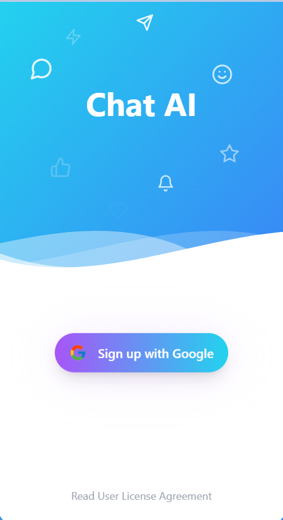
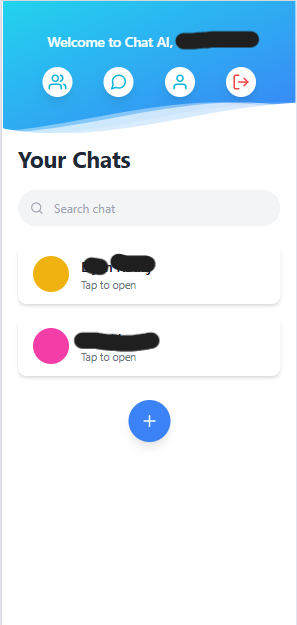
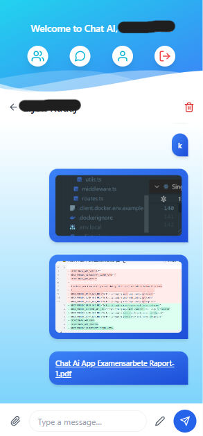

# Chat AI

Chat AI is a modern chat application with AI-powered features that enhance communication without compromising user privacy. The app uses Google Authentication and a unique contact system based on QR codes and shared IDs—no phone numbers or unnecessary personal info needed!

---

## Features

- **Google Sign-In Authentication**  
  Securely sign in with your Google account.

- **Unique Contact Creation**  
  Add contacts by scanning their QR codes or sharing IDs, no phone numbers or location data required.

- **AI-Powered Message Enhancement**  
  Automatically update your text to sound more professional or correct grammar.

- **Contact & Message Management**  
  Full CRUD (Create, Read, Update, Delete) operations for contacts and messages.

- **Media Sharing**  
  Send images and files via AWS S3 bucket uploads.

- **Message Replies & Editing**  
  Reply to messages, delete, or edit your sent texts.

- **Translation Feature**  
  Translate specific words via a redirect to Google Translate.

- **Responsive UI**  
  Built with Tailwind CSS for a smooth and modern user experience.

---

## Tech Stack

- **Frontend:** React, Tailwind CSS
- **Backend:** Node.js, Express
- **Database:** MongoDB (Atlas)
- **Authentication:** Google OAuth
- **File Storage:** AWS S3
- **AI:** OpenAI API integration
- **Deployment:** Vercel

---

## Screenshots

  
*Sign in with Google*

  
*Start a new chat by scanning QR code or sharing ID*

  
*Chat interface showing messages list*

  
*Conversation view with message options*

  
*User profile and settings*

---

## Getting Started

### Prerequisites

- Node.js (v16+ recommended)
- MongoDB Atlas account
- AWS account for S3 bucket
- Google Cloud Console for OAuth credentials
- OpenAI API key

### Installation

1. Clone the repository:

   ```bash
   git clone https://github.com/KristinaJera/chai-ai.git
   cd chai-ai
   
2. Install dependencies:
   
   ```bash
   npm install

4. Create a .env file in the root directory and add the following environment variables:

   OPENAI_API_KEY=your_openai_api_key
   MONGO_URI=your_mongodb_connection_string
   SESSION_SECRET=your_session_secret
   GOOGLE_CLIENT_ID=your_google_client_id
   GOOGLE_CLIENT_SECRET=your_google_client_secret
   BACKEND_URL=http://localhost:3001
   CLIENT_ORIGIN=http://localhost:3000
    
   AWS_REGION=your_aws_region
   AWS_ACCESS_KEY_ID=your_aws_access_key_id
   AWS_SECRET_ACCESS_KEY=your_aws_secret_access_key
   S3_BUCKET_NAME=your_s3_bucket_name

### Running the App Locally

   ```bash
   npm run dev

### Deployment

The app is deployed on Vercel: https://chat-ai-eight-hazel.vercel.app/
